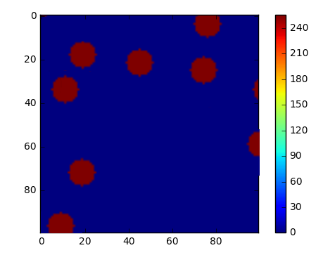

# Occupancy Grid Estimation


##### Instructions for set up
* You will need Tensorflow and GPU support with CUDA to train or test the deep learning network. The complete instructions to install and set up the environment are at this [link](https://www.tensorflow.org/versions/r0.11/get_started/os_setup.html)
* Download the gip repo and mention the location of the hd5y file in the python file main.py. Save the file

##### Describe the approach you took and why you chose it
* Between supervised and unsupervised learning, since we had a large dataset, the context of the sequence of any 20 frames could be learn't thoroughly using supervised learning. In techniques of supervised learning, neural networks are found to be the most powerful tool in time sequence prediction in capturing the temporal relation between the sequential frames. I decided to build a deep learning model on tensorflow which made use of LSTMs. 
* The **rms error** during testing dropped to as low as **10**
* I divided the given set of 1,000,000 images into a training set of 800,000 images and a testing set of 200,000 images. Each sample used to train the network is a sequence of 20 frames with each frame in the sequence being a *100x100* image. The target against which each sequence is trained is the ground truth image at the 21st (or the next) index.

##### Running the model
* Make sure the hd5y file path is mentioned in the file main.py
* To run use:

  ```python
  sudo python main.py <input index>
  ```

* Make sure **input index is between 800,000 and 1,000,000** since the input index should point to an index in the test set and not the training set 
* The network uses a already trained model in the folder [./trainedModels](./trainedModels)
* The output will be the ground truth image and the image predicted using the previous 20 frames of occupancy grid. The system also prints out the accuracy and the rms error.
* An example from testing the trained model:
	* Top is *ground truth* and bottom is *predicted*. The computed RMS error value = ~15.2
	* 
	* 


##### Advantages and disadvantages
* Advantages:
	* Since we are aiming at capturing the temporal relation between 20 frames, LSTMs are proven to do a very good job at that when compared to other model like Hidden Markov models etc
* Disadvantages:
	* Computationally intensive 	
	
##### Relevant materials, if used (books, papers, blogs, ...)
* Used my previous experience on time sequence prediction using neural networks.

##### Breakdown of time spent
* Total 22 hours:
  * 6 hours on trying methods of bayesian estimation and validating any changes of usage of unsupervised learning.
  * 2 hours on setting up the environment for deep learning
  * 12 hours for building and analysing the results of the deep leanrning model
  * 2 hours for setting up readme and pushing code to git

##### Future directions you would take if you had more time
* What would you do with a few days? with a few weeks?
	* Still a lot of optimization can be done on the rms error. I would spend my time on that
    
* What if your algorithm needed to run in real time (20hz)?
	* Since the model is already trained, the model can be used in real time. You just have to feed data sequentially into the system.
* Our simulated sensor data is very clean, how would you deal with noisy real world sensor data.
	* Noise such as salt and pepper noise can be removed using techniques such as median filtering. Extermeties can be removed using PCA decomposition. Given a large enough dataset, the deep learning model is robust enough to alleviate noise. 
* Can your approach infer future states and if so how effective
	* Yes, the predicted frame can be fed back into the network to generate the next frame and so on. Therefore the model can be used to generate sequences given an initial sequence. I haven't implemented and tested this for our scenario but reseach shows that LSTMs can generate meaningful word sentences and phrases when trained well.